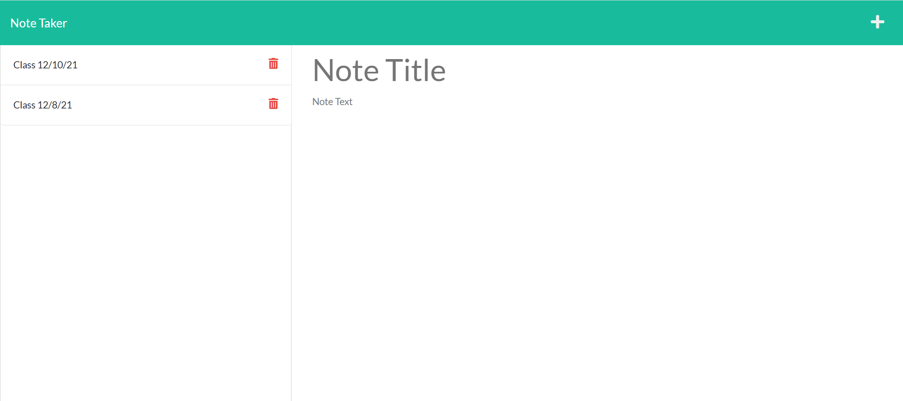

<h1 align="center">Matt's Note Generator</h1>
  

## Description
This application was developed to be able to take notes and was built to be able to manage notes.  The main functionality is to be able to add and delete notes.
This application solved the problem of keeping track of your notes.

## Table of Contents
- [Description1](#description)
- [InstallationInstructions](#installation)
- [Usage](#usage)
- [License](#license)
- [Contributing](#contributing)
- [Tests](#tests)
- [Questions](#questions)

## Installation
NPM I and NPM I Express

## Deployed Application Link
https://fast-cove-86864.herokuapp.com/

## Contact Information
mjc01002 
 
GitHub Link: [mjc01002](https://github.com/mjc01002) 
 
Email me: stoncalkins@gmail.com  

## Screenshot of Application

